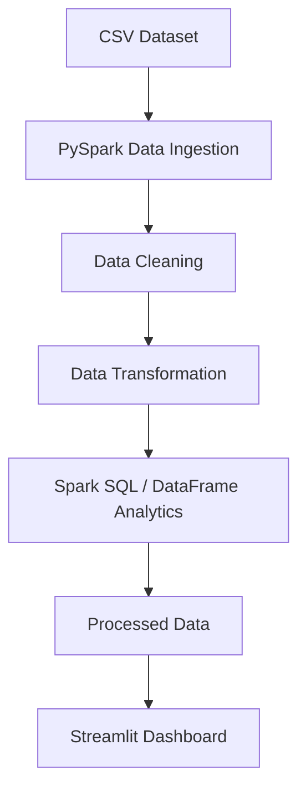

# Project Abstract: E-Commerce Transaction Analytics Using Apache Spark

## Abstract

E-commerce platforms generate large volumes of transactional data every day,
covering customer purchases, product categories, payment methods, and
geographic patterns. Analyzing this data manually or with traditional
single-threaded tools becomes inefficient as data volume grows. This project
presents a Big Data Analytics application that ingests, cleans, transforms,
and analyzes a synthetic e-commerce transaction dataset using **Apache
Spark's distributed DataFrame API and Spark SQL**, and exposes the resulting
insights through an interactive **Streamlit** dashboard. The system
demonstrates a complete, reproducible Big Data pipeline that runs entirely
on a single local machine, making it suitable as an academic demonstration
of core Big Data Analytics concepts without requiring cluster infrastructure.

## Problem Statement

Retail and e-commerce businesses accumulate large, often messy transactional
datasets (missing fields, duplicate records, malformed dates) that must be
cleaned and aggregated before they can support business decisions such as
identifying top-selling products, high-value customers, and regional revenue
trends. Manually processing such data with spreadsheets is slow and does not
scale. There is a need for a Spark-based pipeline that can reliably clean,
transform, and analyze this data, and present findings in an accessible
visual format.

## Objectives

1. Design and generate a realistic, large-scale (10,000+ record) synthetic
   e-commerce transaction dataset.
2. Build a PySpark-based ingestion and cleaning pipeline that handles
   missing values, duplicate records, and invalid data.
3. Implement Spark DataFrame transformations to derive analytical features
   (e.g., total transaction amount, date parts, age groups).
4. Perform a comprehensive set of Big Data analyses (revenue, trends,
   top-N rankings, demographic breakdowns) using both the Spark DataFrame
   API and Spark SQL.
5. Build an interactive Streamlit dashboard with filters and visualizations
   to present the processed insights to end users.
6. Ensure the entire system runs locally on Windows without requiring a
   Hadoop cluster, Docker, or cloud services.

## Existing System

Traditional approaches to transaction analysis in academic and small-business
settings typically rely on Microsoft Excel or single-threaded Python/Pandas
scripts. These approaches:
- Do not scale well as data volume increases.
- Lack a structured, repeatable data-cleaning pipeline.
- Require manual, error-prone steps to produce each report or chart.
- Provide no interactive way to explore data via filters.

## Proposed System

The proposed system uses **Apache Spark (PySpark)** as the processing
engine, which provides a distributed, in-memory DataFrame API capable of
scaling from a single laptop to a full cluster without code changes. The
system is organized as a clear, modular pipeline:

1. **Data Ingestion** — Load the raw CSV with an explicit schema.
2. **Data Cleaning** — Remove duplicates, handle missing values, validate
   numeric and date fields.
3. **Data Transformation** — Derive `total_amount`, date parts, and age
   groups.
4. **Analytics** — Compute 15+ business metrics using Spark DataFrame
   operations and Spark SQL.
5. **Presentation** — Serve the processed results through a Streamlit
   dashboard with KPI cards, sidebar filters, and Plotly visualizations.

This architecture cleanly separates each concern into its own Python module,
making the project both easy to explain in a viva and easy to extend.

## Technologies Used

- **Python 3.10/3.11** — core programming language
- **Apache Spark (PySpark)** — distributed data processing engine
- **Spark SQL** — declarative querying over Spark DataFrames
- **Pandas / NumPy** — dataset generation and dashboard-side data handling
- **Streamlit** — web-based interactive dashboard framework
- **Plotly** — interactive charting library

## Methodology

The project follows a standard **ETL (Extract, Transform, Load) methodology**
adapted for Big Data Analytics:

- **Extract**: `generate_dataset.py` creates the raw CSV; `data_ingestion.py`
  loads it into a Spark DataFrame with an explicit schema.
- **Transform**: `data_cleaning.py` removes bad records; `data_processing.py`
  derives new analytical columns.
- **Load / Analyze**: `analytics.py` and `spark_sql_queries.py` compute
  aggregated metrics, which are saved as CSV/JSON to the `output/` folder.
- **Present**: `app.py` (Streamlit) reads the processed output and renders
  an interactive dashboard.

## System Architecture

## Modules

1. **generate_dataset.py** — synthetic dataset generator
2. **src/data_ingestion.py** — Spark session creation, schema definition, CSV loading
3. **src/data_cleaning.py** — duplicate removal, missing-value handling, validation
4. **src/data_processing.py** — calculated columns and date/age feature engineering
5. **src/analytics.py** — DataFrame-API-based business analytics
6. **src/spark_sql_queries.py** — Spark SQL query demonstrations
7. **run_pipeline.py** — pipeline orchestration script
8. **app.py** — Streamlit dashboard

## Expected Results

- A cleaned dataset with all duplicate, missing, and invalid records
  identified and handled.
- Accurate computation of total revenue, transaction counts, average order
  value, and quantity sold.
- Clear visual identification of top-performing product categories, states,
  cities, products, and customers.
- An interactive dashboard that lets a user filter transactions by date,
  category, state, payment method, and gender, with all KPIs and charts
  updating accordingly.

## Future Scope

- Integrating real-time data ingestion using Spark Structured Streaming.
- Applying Spark MLlib for predictive analytics (e.g., customer churn,
  demand forecasting).
- Scaling the pipeline to a real multi-node Spark cluster for larger
  (multi-GB/TB) datasets.
- Adding customer segmentation using RFM (Recency, Frequency, Monetary)
  analysis.
- Deploying the dashboard to a cloud platform for multi-user access.

## Conclusion

This project demonstrates how Apache Spark can be used to build a complete,
end-to-end Big Data Analytics pipeline — from raw, messy transactional data
to actionable, interactive business insights — entirely on a local machine.
It illustrates core Big Data concepts (distributed DataFrames, lazy
evaluation, Spark SQL, ETL pipelines) in a practical, runnable form suitable
for academic evaluation and further extension.
