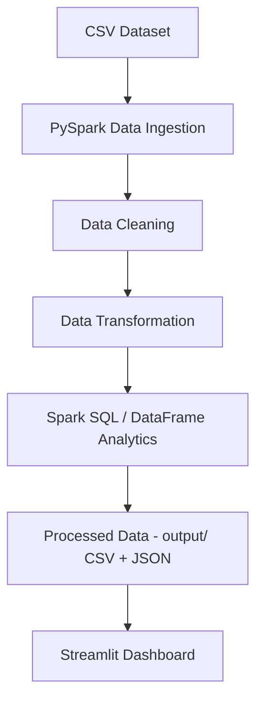

# 🛒 E-Commerce Transaction Analytics Using Apache Spark

A complete **Big Data Analytics (BDA)** academic project that processes a
synthetic e-commerce transaction dataset with **Apache Spark (PySpark)** and
presents the results through an interactive **Streamlit** dashboard.

Runs **100% locally** on Windows/macOS/Linux — no Hadoop cluster, no Docker,
no cloud account required.

---

## 1. Features

- Synthetic dataset generator (10,000+ realistic Indian e-commerce transactions)
- PySpark data ingestion with an explicit schema
- Data cleaning: duplicate removal, missing-value handling, invalid date/number handling
- Data transformation: `total_amount` calculation, date-part extraction, age bucketing
- 15+ Big Data analyses (revenue, trends, top products/customers, demographics, etc.)
- A dedicated Spark SQL module with 7 SQL queries
- An interactive Streamlit + Plotly dashboard with KPI cards and sidebar filters
- Full academic documentation: abstract, viva Q&A, presentation outline

---

## 2. Technology Stack

| Layer            | Technology              |
|-------------------|--------------------------|
| Language          | Python 3.10 / 3.11        |
| Big Data Engine   | Apache Spark (PySpark)   |
| Data Handling     | Pandas, NumPy            |
| Dashboard         | Streamlit                |
| Visualization     | Plotly                   |
| Query Engine      | Spark SQL                |
| Storage           | CSV (local filesystem)   |

No Hadoop, HBase, Kafka, Zookeeper, Kubernetes, or cloud services are used.

---

## 3. Project Structure

```
ecommerce-bda-spark/
│
├── data/
│   └── ecommerce_transactions.csv     # generated by generate_dataset.py
│
├── src/
│   ├── __init__.py
│   ├── data_ingestion.py              # Spark session + schema + CSV load
│   ├── data_cleaning.py               # duplicates, missing values, invalid data
│   ├── data_processing.py             # total_amount, date parts, age groups
│   ├── analytics.py                   # all DataFrame-API analytics (A-Q)
│   └── spark_sql_queries.py           # 7 Spark SQL queries
│
├── output/                            # analytics results (CSV/JSON) - generated
│
├── app.py                             # Streamlit dashboard
├── generate_dataset.py                # synthetic dataset generator
├── run_pipeline.py                    # orchestrates the full Spark pipeline
├── requirements.txt
├── PROJECT_ABSTRACT.md
├── VIVA_QUESTIONS.md
├── PRESENTATION_CONTENT.md
├── .gitignore
└── README.md
```

---

## 4. System Architecture



**Design note:** `run_pipeline.py` runs the heavy Big Data processing
(cleaning, transformation, aggregation, Spark SQL) once using PySpark, and
saves the results to `output/`. `app.py` then reads `output/cleaned_data.csv`
with pandas so that sidebar filters respond instantly — restarting a Spark
JVM on every filter click would make the dashboard slow and is unnecessary
for a dataset of this size. This is standard practice for small/medium BI
dashboards built on top of a Spark batch pipeline.

---

## 5. Windows Setup — Exact Commands

> Open **Command Prompt** or **PowerShell** in the project folder and run
> each step below, in order.

### Step 1: Install Python
Download and install Python 3.10 or 3.11 from https://www.python.org/downloads/
✅ During installation, check **"Add Python to PATH"**.

Verify:
```
python --version
```

### Step 2: Create a virtual environment
```
python -m venv venv
```

### Step 3: Activate the virtual environment
```
venv\Scripts\activate
```
(You should see `(venv)` appear at the start of your terminal prompt.)

### Step 4: Install dependencies
```
pip install -r requirements.txt
```

### Step 5: Generate the dataset
```
python generate_dataset.py
```

### Step 6: Run the Spark processing pipeline
```
python run_pipeline.py
```

### Step 7: Launch the Streamlit dashboard
```
streamlit run app.py
```

Your browser will automatically open `http://localhost:8501` with the dashboard.

---

## 6. Java Requirement (for PySpark)

PySpark needs **Java 8, 11, or 17** installed (Java is the runtime Spark's
JVM engine runs on).

Check if Java is installed:
```
java -version
```

If not installed, download **Temurin JDK 11** from https://adoptium.net/
and install it, then re-open your terminal and re-run Step 6.

---

## 7. Common Errors and Fixes

| Error | Cause | Fix |
|---|---|---|
| `'python' is not recognized` | Python not on PATH | Reinstall Python with "Add to PATH" checked |
| `JAVA_HOME is not set` / Spark fails to start | Java not installed or not on PATH | Install JDK 11 (see Section 6), restart terminal |
| `Could not locate executable null\bin\winutils.exe` | Spark on Windows looking for Hadoop's winutils | This project avoids Spark-side file writes, so it usually does not appear; if it does, download `winutils.exe` for your Hadoop version, place it in `C:\hadoop\bin`, and set `HADOOP_HOME=C:\hadoop` |
| `FileNotFoundError` / `data/ecommerce_transactions.csv not found` | Dataset not generated yet | Run `python generate_dataset.py` |
| Dashboard shows "No processed data found" | Pipeline not run yet | Run `python run_pipeline.py` before `streamlit run app.py` |
| `ModuleNotFoundError: No module named 'src'` | Running a script from the wrong folder | Always run commands from the project root folder |
| Port 8501 already in use | Another Streamlit app is running | `streamlit run app.py --server.port 8502` |
| Pipeline runs but seems slow the first time | Spark JVM cold start | This is normal — subsequent runs are faster |

---

## 8. Demonstrating This Project to Your Professor in 5 Minutes

1. **(30s)** Show the project structure and explain the pipeline diagram in this README.
2. **(30s)** Run `python generate_dataset.py` live — explain it creates a realistic 10,000+ row dataset with intentional dirty data (missing values, duplicates, bad dates).
3. **(1.5 min)** Run `python run_pipeline.py` — narrate the console output as it prints: rows ingested → duplicates removed → missing values handled → invalid rows dropped → analytics computed → Spark SQL queries run → outputs saved. This is your PySpark proof.
4. **(2 min)** Run `streamlit run app.py` — walk through the KPI cards, then change a sidebar filter (e.g. State = Telangana) and show the charts update instantly.
5. **(30s)** Briefly open `src/spark_sql_queries.py` and point to the SQL strings — mention Spark SQL is used alongside the DataFrame API.
6. **(Optional, 30s)** Open `output/` folder to show the saved CSV/JSON analytics artifacts.

---

## 9. Future Enhancements

- Add a real-time streaming layer (Spark Structured Streaming) for live order feeds
- Add a recommendation engine (Spark MLlib collaborative filtering)
- Add cohort/retention analysis and RFM customer segmentation
- Containerize with Docker for portability (kept out of v1 for simplicity)
- Move storage to a proper data warehouse (e.g. PostgreSQL) for larger datasets
- Add authentication and role-based views to the dashboard

---

## 10. Screenshots

*(Add your dashboard screenshots here after running the project.)*

```
docs/screenshots/dashboard_overview.png
docs/screenshots/dashboard_filters.png
```

---

## 11. Academic Documentation

- [`PROJECT_ABSTRACT.md`](PROJECT_ABSTRACT.md) — abstract, objectives, methodology, architecture
- [`VIVA_QUESTIONS.md`](VIVA_QUESTIONS.md) — 30+ BDA viva questions with answers
- [`PRESENTATION_CONTENT.md`](PRESENTATION_CONTENT.md) — ready-to-use content for a 10–12 slide PPT

---

## 12. License

This project was built for academic/educational purposes. Free to use and modify for coursework.
